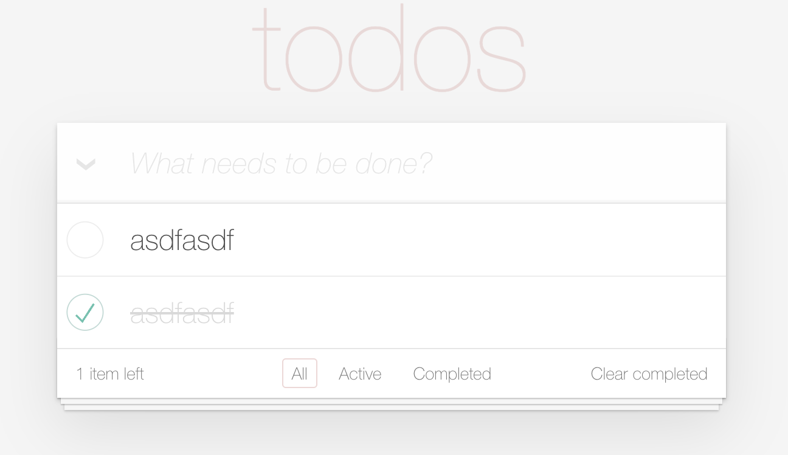

# Todo App
This repo is the template to start your app.
first make sure you are familiar with these technologies (read their docs)
- typescript
- react
- [Next.js](https://nextjs.org)
- [Prisma](https://prisma.io)
- [tRPC](https://trpc.io)
- [react-query](https://tanstack.com/query/latest/docs/react/overview)
- zod
- [mantine](https://mantine.dev)

## Prepare
- install - `npm i`
- to prepare the db - `npm run prisma push`

## Your task
create a todo app with the following features
- add todo
- delete todo
- mark todo as done
- mark todo as not done
- edit todo
- filter todos by status (done, not done, all)
- all todos are saved in the database
- all todos are fetched from the database

## Rules
- use trpc for all your api calls
- create prisma models for your todos
- use all ui components from mantine (buttons, inputs, etc)

## Example of todo app
https://todomvc.com/examples/react/#/

### How do I deploy this?

Follow our deployment guides for [Vercel](https://create.t3.gg/en/deployment/vercel), [Netlify](https://create.t3.gg/en/deployment/netlify) and [Docker](https://create.t3.gg/en/deployment/docker) for more information. -->

### Learn More

To learn more about the [T3 Stack](https://create.t3.gg/), take a look at the following resources:

- [Documentation](https://create.t3.gg/)
- [Learn the T3 Stack](https://create.t3.gg/en/faq#what-learning-resources-are-currently-available) — Check out these awesome tutorials

You can check out the [create-t3-app GitHub repository](https://github.com/t3-oss/create-t3-app) — your feedback and contributions are welcome!

### Based on: "Create T3 App"

This is a [T3 Stack](https://create.t3.gg/) project bootstrapped with `create-t3-app`.

